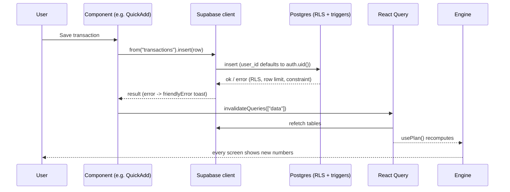

# Architecture

## Tech stack (from `package.json`)

| Layer | Package | Version |
|---|---|---|
| Framework | `@tanstack/react-start` | 1.168.60 |
| Router | `@tanstack/react-router` | 1.170.41 |
| UI | `react`, `react-dom` | ^19.2.0 |
| Build | `vite` | 8.1.5 (via `@lovable.dev/vite-tanstack-config` ^2.24.0) |
| Styling | `tailwindcss`, `@tailwindcss/vite` | ^4.2.1 |
| Data | `@tanstack/react-query` | ^5.101.1 (+ persist-client / sync-storage-persister ^5.104.1) |
| Backend client | `@supabase/supabase-js` | ^2.117.2 |
| Tests | `vitest` ^4.1.10, `jsdom`, `@testing-library/react` | |
| Language | `typescript` | ^5.8.3 |

## Folder structure

| Path | Purpose |
|---|---|
| `src/routes/` | File-based routes (TanStack Router) |
| `src/routes/__root.tsx` | HTML shell, query persistence, auth listener, theme/locale inline scripts, PWA registration, error/404 screens |
| `src/routes/_authenticated/route.tsx` | Client-only sign-in gate |
| `src/routes/_authenticated/_app/route.tsx` | Onboarding gate + `AppShell` |
| `src/components/` | App components (shell, forms, planner, dev tools) |
| `src/components/ui/` | shadcn/ui primitives |
| `src/lib/engine/` | Pure calculation engine + tests |
| `src/lib/data.ts` | Query options for every table, `useInvalidateData`, `friendlyError` |
| `src/lib/profile.ts` | Profile query |
| `src/lib/use-plan.ts` | Feeds rows into the engine for the selected month |
| `src/lib/use-health.ts` | Health-check inputs |
| `src/lib/csv.ts` | CSV export/import (pure) |
| `src/lib/budget-rules.ts`, `parse.ts` | Name and number validation |
| `src/lib/format.ts` | Money/date formatting, `todayISO` |
| `src/lib/i18n/` | Translations (`index.ts`, `ar.ts`) |
| `src/lib/dev-tools.ts` | Reset data / load test scenario |
| `src/lib/sample-data.ts` | Sample dataset |
| `src/lib/pwa-register.ts` | Service-worker registration (guarded) |
| `src/integrations/supabase/` | Auto-generated backend clients and types |
| `src/test/` | Routing and privacy tests, test setup |
| `supabase/migrations/` | Database SQL |
| `scripts/rls-check.ts` | Manual RLS check |
| `public/` | Icons, `manifest.webmanifest`, `robots.txt` |
| `docs/` | Documentation |

## Routing

| URL | File |
|---|---|
| `/` | `src/routes/index.tsx` |
| `/auth` | `src/routes/auth.tsx` |
| `/onboarding` | `src/routes/_authenticated/onboarding.tsx` |
| `/dashboard`, `/add`, `/log`, `/budget`, `/tracker`, `/income`, `/goals`, `/accounts`, `/recurring`, `/zakat`, `/interest`, `/health`, `/more`, `/settings`, `/ramadan`, `/qurbani`, `/hajj` | `src/routes/_authenticated/_app/<name>.tsx` |

`_authenticated` (`ssr: false`) redirects to `/auth` when `supabase.auth.getUser()` returns no user. When offline, it trusts the stored session instead. `_app` redirects to `/onboarding` until `profiles.onboarding_completed` is true.

## State and data fetching

- **Query client:** created in `src/router.tsx` with `gcTime` set to 7 days.
- **Table reads:** use query options in `src/lib/data.ts`, keyed `["data", <table>]`. These cover categories, income_sources, accounts, goals, transfers, recurring_items, transactions (latest 2,000), income_entries, zakat_settings, zakat_lines, interest_received, interest_given and module_plans. The profile query is in `src/lib/profile.ts`.
- **`usePlan()`** (`src/lib/use-plan.ts`) loads the profile, categories, transactions, goals, income entries and income sources. It calls `computePlan`, `goalTotals` and `monthSummary` with `today = todayISO()` for the profile's `selected_month`.
- **Writes:** go directly through `supabase.from(...)` in components, then call `useInvalidateData()`, which invalidates `["data"]`. Profile changes (onboarding, settings) use `refetchQueries({ type: "all" })`.
- **Persistence:** `PersistQueryClientProvider` in `__root.tsx` saves the cache to localStorage key `hbp-cache` (maxAge 7 days, buster `v1`). It is removed on sign-out (`settings.tsx`).
- **Auth events:** `supabase.auth.onAuthStateChange` is wired once in `__root.tsx`.
- **Global UI state:** theme in localStorage `hbp-theme`; locale in `profiles.locale` mirrored to `hbp-locale`.

## Action flow

## Component map

| Screen | Main components |
|---|---|
| Shell | `AppShell.tsx` (sidebar / bottom bar, FAB → `QuickAdd.tsx`), `OfflineBanner.tsx` |
| Dashboard | `PageHeader`, `MonthSwitcher`, `SetupChecklist`, `SampleDataCard`, `EmptyState`, recharts |
| Tracker | `PageHeader`, `MonthSwitcher`, `StatusBadge`, `EmptyState` |
| Add / Quick Add | `TransactionForm` |
| Zakat / Interest | `Disclaimer` (+ `Stat`) |
| Planners | `PlannerPage` |
| Settings | `PageHeader`, `MonthPicker`, `ThemeToggle`, `DataCard` (CSV), `SettingsExtras` (Modules, New year), `DevTools` |
| Budget / Log | `PageHeader`, `SampleDataCard`, `EmptyState` |
| Onboarding | `MonthPicker` |
| All data pages | `EmptyState`, `PageSkeleton` (`EmptyState.tsx`) |

## Dependencies and why

Checked by searching imports in `src/` (outside `src/components/ui/`).

| Package | Why | Used by app code? |
|---|---|---|
| `@tanstack/react-start`, `react-router`, `router-plugin` | Framework, file routing | yes |
| `@tanstack/react-query` (+ persist-client, sync-storage-persister) | Caching, offline reading | yes |
| `@supabase/supabase-js` | Auth and database | yes |
| `recharts` | Dashboard charts (`dashboard.tsx`) | yes |
| `sonner` | Toasts | yes |
| `lucide-react` | Icons | yes |
| `@radix-ui/*`, `class-variance-authority`, `clsx`, `tailwind-merge`, `vaul` | shadcn/ui primitives | Only these primitives are imported: `alert-dialog`, `button`, `dialog`, `drawer` (vaul), `input`, `label`, `select`, `skeleton`, `sonner`, `switch` |
| `tailwindcss`, `@tailwindcss/vite`, `tw-animate-css` | Styling | yes |
| `react-hook-form`, `@hookform/resolvers`, `zod`, `date-fns`, `react-day-picker`, `cmdk`, `embla-carousel-react`, `input-otp`, `react-resizable-panels` | Template defaults | **no**, only referenced by unused shadcn files |
| `vite-plugin-pwa` (dev) | Service worker (`vite.config.ts`) | yes |
| `vitest`, `jsdom`, `@testing-library/*` (dev) | Tests | yes |
| `nitro` (dev) | Server build target | build only |

The other 36 files in `src/components/ui/` (e.g. `card`, `table`, `tabs`, `sheet`, `chart`, `popover`) are not imported by app code.
