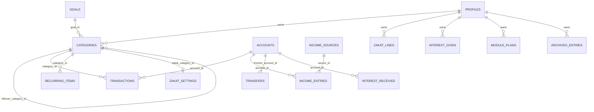

# Backend and database

## Who owns the backend

It is **managed by Lovable (Lovable Cloud)**. It is not a Supabase project in your own Supabase account.

How to tell:
- `supabase/config.toml` contains only `project_id = "biicbbzqhkadbjhrecsg"`.
- That project does not appear in your supabase.com dashboard. You manage it from Lovable's "View Backend" panel.
- Its service-role key and database password are not available to you.
- One instance serves both the preview and the published app.

## SQL (runnable migrations)

The complete schema is already in `supabase/migrations/`. Run the files in filename order. This task changed neither them nor the live database.

| File | Contents |
|---|---|
| `20261003155016_ef57a369-….sql` | Enums `category_type`, `leftover_mode`, `goal_priority`, `recurring_frequency`, `zakat_basis`, `zakat_line_kind`. Functions `set_updated_at`, `enforce_row_limit`, `normalize_profile_months`, `handle_new_user` (security definer). All tables except `archived_entries`. Unique `(user_id, name)` on goals, categories, accounts and income_sources. Unique `(id, user_id)` for composite FKs. Unique `(user_id, module)` on module_plans. Indexes `transactions_user_date_idx` and `income_entries_user_date_idx`. Grants to `authenticated` and `service_role`. RLS enabled with policy "Own rows" / "Own profile" on every table. Row-limit triggers. Trigger `on_auth_user_created` on `auth.users`. |
| `20261003155046_1d86ba4e-….sql` | Empty |
| `20261003180533_4fbff957-….sql` | `archived_entries` + grants + RLS; function `start_new_year(date, jsonb, jsonb)` (security invoker), with execute granted to `authenticated` |

Read the files for the full SQL. I didn't copy it here so there's a single source of truth.

### Triggers

| Trigger | Table | When | Function |
|---|---|---|---|
| `on_auth_user_created` | auth.users | after insert | `handle_new_user` (creates profile) |
| `profiles_normalize` | profiles | before insert/update | `normalize_profile_months` (plan_start, selected_month → 1st) |
| `profiles_updated`, `module_plans_updated`, `zakat_settings_updated` | | before update | `set_updated_at` |
| `*_limit` | categories 50, income_sources 5, income_entries 300, transactions 1500, goals 10, accounts 10, recurring_items 50 | before insert | `enforce_row_limit(n)` |

### RLS

Every table has one policy for `authenticated`: `using (user_id = auth.uid()) with check (user_id = auth.uid())`. No `anon` grants exist.

## Entity-relationship diagram

All foreign keys are composite `(id, user_id)` with `ON DELETE SET NULL`, so a row can never point at another user's row.

## Auth settings the app relies on

| Setting | Value |
|---|---|
| Providers | Email + password only (`src/routes/auth.tsx`) |
| Email confirmation | Off (auto-confirm), a development choice |
| Leaked-password (HIBP) check | Off |
| Minimum password length | 6 |
| Redirect URL | Sign-up passes `emailRedirectTo: origin + "/dashboard"` (`auth.tsx`), so allow `<site>/**` |
| Anonymous sign-ins | Off |

## Edge functions and secrets

- **None.** There is no `supabase/functions/` folder, and there are no `createServerFn` calls in `src/` outside the generated integrations.
- Platform-managed secrets exist in the Lovable Cloud project (`LOVABLE_API_KEY`, `LOVABLE_CRON_SECRET`, `SUPABASE_SERVICE_ROLE_KEY`, `SUPABASE_DB_URL`, `SUPABASE_ANON_KEY`, `SUPABASE_URL`). No app code uses them.

## Front-end environment variables

| Variable | Where to find the value |
|---|---|
| `VITE_SUPABASE_URL` | Supabase → Project Settings → API → Project URL |
| `VITE_SUPABASE_PUBLISHABLE_KEY` | Project Settings → API Keys → publishable / anon key |
| `VITE_SUPABASE_PROJECT_ID` | Project Settings → General → Reference ID |
| `SUPABASE_URL`, `SUPABASE_PUBLISHABLE_KEY` | Same values; server-render fallback in `src/integrations/supabase/client.ts` |

## Recreate and verify in a fresh Supabase project

1. Create the project, then run `supabase link --project-ref <ref>` and `supabase db push`, or paste the three files into the SQL editor in order.
2. Auth → Providers: enable Email. Set confirmation, HIBP and minimum length as in the table above. Set the Site URL and redirect URLs.
3. Put the three `VITE_` values in `.env` and update `supabase/config.toml`.
4. Regenerate types: `supabase gen types typescript --project-id <ref> > src/integrations/supabase/types.ts`.
5. Verify:
   - [ ] 15 public tables exist, each with RLS enabled.
   - [ ] Signing up creates a `profiles` row.
   - [ ] Onboarding leads to the Dashboard.
   - [ ] "Load test scenario" shows August actual ₹47,100 on the Tracker.
   - [ ] A 51st category is rejected.
   - [ ] "Start a new year" works.
   - [ ] `bun scripts/rls-check.ts` prints PASS.

## Unverified

- The live schema has not been diffed object by object against the files. Everything the live project lists does match.
- Email templates, SMTP, rate limits and JWT expiry are assumed to be Supabase defaults.
- I couldn't read back the auth settings; they reflect what was configured earlier in this project.
- Regenerating `types.ts` with the Supabase CLI hasn't been tested here.
